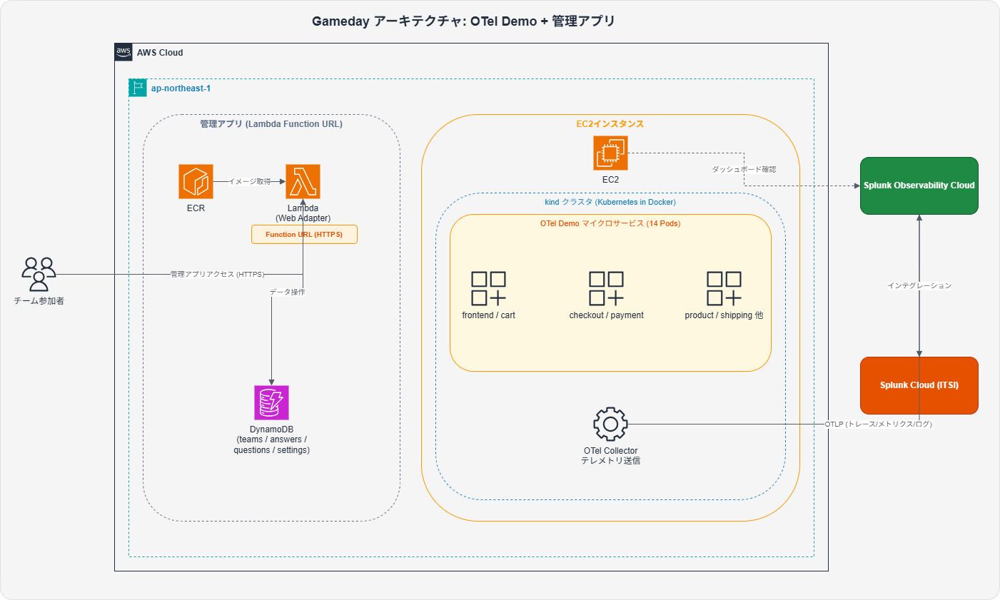

# o11y Game Day

OpenTelemetry DemoにFeature Flagsで障害を注入し、Splunk APM/Infrastructureで原因を特定するチャレンジゲーム。



## 前提条件

### ローカル環境
- AWS CLI（設定済み・デプロイ先アカウントへの権限あり）
- Docker（管理アプリのビルドに使用）
- EC2 KeyPair（事前にAWSコンソールで作成済み）

### AWSアカウント権限
- CloudFormation / EC2 / ECR / Lambda / DynamoDB / IAM / CloudWatch Logs / SSM

### 組織タグの付与

AWSアカウントのリソース作成において、組織固有のタグ付与が必須となる場合があります（SCP等でタグなしリソース作成が制限されている場合）。

**EC2 + kindスタック**: `aws cloudformation deploy --tags` でスタックレベルタグとして付与してください。スタックレベルタグはスタック内の全リソースに自動伝播します。

```bash
# タグ付与例（EC2 + kindスタック）
aws cloudformation deploy \
  --template-file ... \
  --tags \
    Project=o11y-gameday \
    data_classification=public \
    environment_type=non-prd
```

**管理アプリ**: `deploy-admin.sh` の `--tags` オプションで渡したタグはスタックレベルタグとして適用されます。Lambda は内部で ALB 等を作成しないため、スタックレベルタグのみで SCP 要件を満たします。

```bash
# タグ付与例（管理アプリ）- スペース区切りで指定
./deploy-admin.sh \
  --tags splunkit_data_classification=public splunkit_environment_type=non-prd \
  ...
```

ECRリポジトリやKubernetes namespaceなどCloudFormation外のリソースには、各自で適切にタグを付与してください。

### Splunkアカウント
- Splunk Observability Cloud アカウント
- (オプション) Splunk ITSI、Cisco ThousandEyes ← Q8以降で使用。事前準備が必要です

## 事前準備（必要な情報を用意する）

デプロイ前に以下の情報を確認してください：

| 変数 | 説明 | 取得場所 |
|------|------|----------|
| `EC2_KEY_PAIR` | EC2 KeyPair名（`.pem`不要） | AWS Console > EC2 > Key Pairs |
| `SPLUNK_ACCESS_TOKEN` | Splunkアクセストークン（INGEST scope）。EC2スタックとdeploy-teams.shで使用 | Splunk Observability > Settings > Access Tokens |
| `SPLUNK_RUM_TOKEN` | Splunk RUMトークン（RUM ingest scope）。deploy-teams.shと管理アプリで使用 | 同上 |
| `SPLUNK_REALM` | Splunkレルム（例: `jp0`） | Splunk Observability > Settings > General Settings |
| `ADMIN_PASSWORD` | 管理画面のパスワード（任意の文字列） | 自分で決める |

## デプロイ手順

### 1. EC2 + kindクラスタの作成

ローカルから実行します。CloudFormation完了後、EC2のUserDataがkindクラスタのセットアップを自動実行します（約5〜10分）。

```bash
aws cloudformation deploy \
  --template-file gameday/infra/ec2-kind-template.yaml \
  --stack-name gameday-kind \
  --region ap-northeast-1 \
  --capabilities CAPABILITY_NAMED_IAM \
  --parameter-overrides \
    KeyName=<EC2_KEY_PAIR> \
    SplunkAccessToken=<SPLUNK_ACCESS_TOKEN> \
    SplunkRealm=<SPLUNK_REALM> \
  --tags Project=o11y-gameday
```

> フォークリポジトリを使用する場合は `GitRepoUrl` と `GitBranch` パラメータで指定できます（デフォルト: `gentksb/opentelemetry-demo` の `tgen/o11y-gameday` ブランチ）。

### 2. EC2のIPアドレス・インスタンスIDを取得

```bash
aws cloudformation describe-stacks \
  --stack-name gameday-kind \
  --region ap-northeast-1 \
  --query "Stacks[0].Outputs" \
  --output table
```

出力例：`PublicIP`, `InstanceId`, `FrontendURL`, `SSHCommand` が表示されます。

### 3. EC2の起動完了を確認

UserDataのセットアップログを確認します。`"Game Day setup complete"` が出るまで待機してください。

```bash
# SSMセッションでEC2にログイン
aws ssm start-session --target <INSTANCE_ID> --region ap-northeast-1
```

セッション内で：
```bash
sudo tail -f /var/log/user-data.log
```

`Game Day setup complete` が表示されたらCtrl+Cで終了し、`exit` でセッションを抜けます。

### 4. OpenTelemetry Demoのデプロイ

EC2にログインして `deploy-teams.sh` を実行します。リポジトリはUserDataで `/home/ec2-user/opentelemetry-demo` にクローン済みです。

**方法A: SSMセッション（SSH不要）**

```bash
aws ssm start-session --target <INSTANCE_ID> --region ap-northeast-1
```

セッション内で：
```bash
bash /home/ec2-user/opentelemetry-demo/gameday/infra/deploy-teams.sh \
  --splunk-token <SPLUNK_ACCESS_TOKEN> \
  --rum-token <SPLUNK_RUM_TOKEN> \
  --splunk-realm <SPLUNK_REALM> \
  --cluster-name gameday-kind \
  --enable-flags
```

**方法B: SSH接続**

```bash
ssh -i <EC2_KEY_PAIR>.pem ec2-user@<EC2_IP> \
  "bash /home/ec2-user/opentelemetry-demo/gameday/infra/deploy-teams.sh \
    --splunk-token <SPLUNK_ACCESS_TOKEN> \
    --rum-token <SPLUNK_RUM_TOKEN> \
    --splunk-realm <SPLUNK_REALM> \
    --cluster-name gameday-kind \
    --enable-flags"
```

デプロイ完了後、OTel environmentタグが表示されます（例: `gameday-kind-a1b2c3`）。Splunk APMでのフィルタに使用します。

### 5. 管理アプリのデプロイ

ローカルから実行します。初回は `--create-dynamodb` を付けてDynamoDBテーブルを作成します。

```bash
cd gameday/admin-app
./deploy-admin.sh \
  --create-dynamodb \
  --cluster-name gameday-kind \
  --splunk-realm <SPLUNK_REALM> \
  --splunk-access-token <SPLUNK_ACCESS_TOKEN> \
  --rum-token <SPLUNK_RUM_TOKEN> \
  --admin-password <ADMIN_PASSWORD>
```

デプロイ完了後に Lambda Function URL が表示されます。

> 同一アカウントに複数のGame Day環境をデプロイする場合は `--stack-suffix` でスタック名を分けてください：
> `./deploy-admin.sh --stack-suffix event2 --create-dynamodb ...`

### 6. 設問変更後の管理アプリ更新

`admin-app/src/services/scoring.ts` を変更した後、イメージを再ビルドしてデプロイします：

```bash
cd gameday/admin-app
./update-image.sh
```

## アクセスURL

| サービス | URL |
|---------|-----|
| フロントエンド | `http://<EC2_IP>:8080` |
| Feature Flag UI | `http://<EC2_IP>:8080/feature/` |
| 管理アプリ（参加者） | `https://<LAMBDA_URL>` |
| 管理アプリ（運営） | `https://<LAMBDA_URL>/admin` |

## ゲーム設問

### コンセプト

参加者はSREチームの一員として、「顧客からの問い合わせ」「同僚からの相談」「システムアラート」を起点に障害調査を行うロールプレイ形式。APM Trace・Service Map・RUM・Infrastructure Navigator を横断的に活用する。

### フラグ運用方針

`--enable-flags` 指定時に以下のフラグが自動的に有効化されます（単一フェーズ、全問同時出題）：

| フラグ名 | 設定値 | 使用設問 |
|---------|--------|---------|
| `cartFailure` | on | Q2 |
| `imageSlowLoad` | 5sec | Q3 |
| `adHighCpu` | on | Q5 |
| `paymentFailure` | 50% | Q6, Q7 |

Feature Flag UIからも手動で変更可能です。

### 設問一覧

設問定義は `gameday/admin-app/src/services/scoring.ts` の `QUESTIONS` 配列に保存されています。

> **注意**: Q8（ThousandEyes拠点数）,Q10はITSIとThousandEyes連携が必要なため、デフォルトではコメントアウトされています。Q9は別途Syntheticsの設定が必要となるため同様です。
> 連携を実施したり、必要なSynthetics testの設定を有効化できる場合は `scoring.ts` のコメントアウトを解除し、 `./update-image.sh` を実行してください。

## クリーンアップ

```bash
# 管理アプリ削除（ローカルから実行）
cd gameday/admin-app
./deploy-admin.sh --delete

# EC2 + kindスタック削除（ローカルから実行）
aws cloudformation delete-stack --stack-name gameday-kind --region ap-northeast-1
```

アプリケーションのみ削除してEC2を残す場合（EC2にSSM/SSHで接続後）：
```bash
bash /home/ec2-user/opentelemetry-demo/gameday/infra/cleanup-teams.sh --force
```

## トラブルシューティング

| 症状 | 対処 |
|------|------|
| UserDataのセットアップが終わらない | `sudo tail -100 /var/log/user-data.log` でエラーを確認 |
| `deploy-teams.sh: manifest file not found` | EC2のUserDataがまだ実行中。ログを確認して完了を待つ |
| flagdがPending | `local-path` StorageClassが未作成。deploy-teams.shが自動作成するが、`kubectl get sc` で確認 |
| Splunkにデータが届かない | `kubectl get pods -n splunk-monitoring` でCollectorの状態を確認。`kubectl logs -n splunk-monitoring -l app=splunk-otel-collector` |
| Feature Flagが動作しない | `kubectl logs -n otel-demo deployment/flagd` |
| `/admin` にログインできない | `deploy-admin.sh --admin-password <PASSWORD>` で再デプロイ |
| スコアボードAPIが500エラー | `aws dynamodb list-tables` でテーブル存在確認。`--create-dynamodb` 付きで再デプロイ |
| 管理アプリが403を返す | Lambda コンソールで関数 URL の認証タイプが「なし」かつ `lambda:InvokeFunction` と `lambda:InvokeFunctionUrl` のパブリック許可が付与されているか確認 |
| 管理アプリ削除後にDynamoDBテーブルが残る | `DeletionPolicy: Retain` によりテーブルは保持される。`deploy-admin.sh --delete` で対話的に削除可能 |
